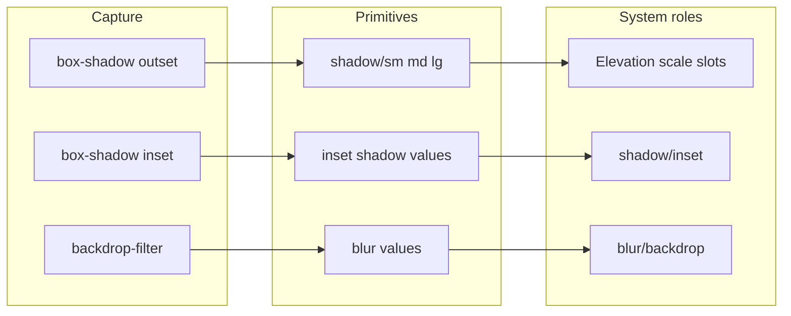

# Effects two-tier roles + capture coherence

## DECISIONS.md (log earlier session + this plan) — do first on execute

Append-only updates to [`docs/DECISIONS.md`](docs/DECISIONS.md) before/during ship:

| Item | Status | Action |
|------|--------|--------|
| §2.47 Two-tier spacing | Already logged | Keep; seed note already points at §2.49 |
| §2.48 Spacing primitives one card | Already logged | Keep |
| §2.49 Page inset = 2× xl, 32–160 | Already logged | Keep |
| Extra values heading removed | Copy tweak | Optional §6 history row only (no new §2.x) |
| **§2.50 Effects two-tier** (this plan) | **Add** | New subsection + §6 row: elevation vs `shadow/inset` vs `blur/backdrop`; kind↔role harden; extension backdrop-filter capture; Figma BACKGROUND_BLUR deferred |

Bump `Last updated` to 2026-07-20 (or ship day). Rejected in §2.50: new TokenType; requiring blur/inset for complete when absent.

---

## Diagnosis (current)

- Blur is still `type: "shadow"` in [`docs/types.ts`](docs/types.ts) (contract stays; encoding via [`src/engine/effect-kinds.ts`](src/engine/effect-kinds.ts)).
- Appendix B only has elevation: `shadow/sm|md|lg`. Inset and blur are customs (`effect/` / `blur/` per §2.46) or compete incorrectly with elevation.
- **Bug:** [`AddTokenDialog`](src/components/AddTokenDialog.tsx) keeps a stale `shadow/md` when switching to Background blur; auto-role only if `role` is empty. [`assignRole`](src/state/pool.ts) does not reject kind mismatches → UI shows blur under Elevation (`RoleFilledRow` on `shadow/md`).
- Extension captures `box-shadow` / `text-shadow` with `inset` preserved, but **never** `backdrop-filter` — glass cannot enter the pool from snap.

## Target model (mirror Spacing / Color)

| Kind | Primitive inventory | System role | Completeness |
|------|---------------------|-------------|--------------|
| Outer drop | Elevation scale `shadow/sm · md · lg` | Same slots (scale = roles, like radius) | ≥1 `shadow/sm|md|lg` (unchanged) |
| Inner inset | Listed as inset primitives (not on elevation ladder) | **`shadow/inset`** (new lean semantic, Appendix B) | Suggested; **seed when capture has inset**; not required if none |
| Backdrop blur | Blur primitives | **`blur/backdrop`** (canonical semantic; customs `blur/…` / `effect/…` still allowed) | Suggested; **seed when blur present**; not required if none |

**Hard rules (all assignment paths):**

- Elevation roles ↔ drop only (`!inset` && `!isBackdropBlurToken`)
- `shadow/inset` ↔ inset layers only
- `blur/*` / `effect/*` / `blur/backdrop` ↔ backdrop-blur only
- Clear stale role when Add dialog switches effect kind; reject cross-links in `assignRole`

**Derive-from-capture principle (align with existing semantics):** same pattern as `space/page` (context), colors (cssProperty × element), feedback harvest — empty semantic slots claim matching captured primitives first; only synthesize elevation ramp for missing drop slots.

### Cross-reference: webapp semantic seeding (keep consistent)

| Domain | Scale / primitives | Semantic jobs | Seed when capture available |
|--------|-------------------|---------------|-----------------------------|
| Color | named hues | text/surface/action/border/feedback | context + harvest |
| Type | size ladder | display…body… | element + ratios |
| Space | `xs…2xl` | `page/section/stack/inset` | context + scale formula |
| Radius / border | slots | (slots are the roles) | size rank |
| **Effects (new)** | drop ladder | **`shadow/inset`**, **`blur/backdrop`** (+ customs) | inset flag / backdrop markers |

No new required Completeness gates beyond today’s ≥1 elevation shadow (avoids blocking systems with no glass/inset).

---

## Part A — Webapp

### A1. Taxonomy + validity

- Add `shadow/inset` and `blur/backdrop` to [`taxonomy.ts`](src/engine/roles/taxonomy.ts) (meanings: inner depth / pressed wells; frosted glass / modal scrim blur).
- Keep `SHADOW_CUSTOM_PREFIXES`; `blur/backdrop` is first-class; extra `blur/…` / `effect/…` remain customs.
- Update PRD B.3/B.4 context table; DECISIONS **§2.50**; export Agent rules briefly when roles assigned.

### A2. Derive + candidates

- [`roles/derive.ts`](src/engine/roles/derive.ts) `assignShadowSlots`: exclude inset **and** blur from elevation ranking; if any inset token, candidate `shadow/inset`; if any blur token, candidate `blur/backdrop` (authoredName exact still wins).
- [`derive-system/index.ts`](src/engine/derive-system/index.ts): elevation ramp seeds from drops only; fill open `shadow/inset` / `blur/backdrop` from captured tokens (no inventing blur if absent).
- [`PrimitivePicker`](src/components/PrimitivePicker.tsx) + [`pool.assignRole`](src/state/pool.ts): enforce kind↔role; on load/import, **clear** assignments that violate (blur on `shadow/md`, inset on elevation, drop on blur role).

### A3. Add / UI

- [`AddTokenDialog`](src/components/AddTokenDialog.tsx): on `effectKind` change, reset `role`; backdrop default name/role `blur/backdrop` when empty; inset offers `shadow/inset`.
- [`EditRolesPanel`](src/components/EditRolesPanel.tsx) / [`SystemView`](src/components/SystemView.tsx): three blocks — **Elevation** (`shadow/sm|md|lg`) · **Inner shadow** (`shadow/inset` + custom `shadow/…` non-scale) · **Background blur** (`blur/backdrop` + `effect/`/`blur/` customs).
- Effects **Primitives**: elevation ladder (like spacing scale) + orphan drops; separate inset list; separate blur list (no “Extra values” chrome). Fix the reported `shadow/md` ↔ blur link via A2 repair.

### A4. Tests / oracle

- Unit tests: kind filters, seed inset/blur from fixture tokens, Add dialog role clear, assignRole rejection.
- Update [`docs/examples/design.example.md`](docs/examples/design.example.md) only if oracle fixtures gain inset/blur roles; otherwise keep elevation tables, add agent-rule lines when roles present.
- `npm test` + `tsc --noEmit`.

---

## Part B — Browser extension capture (coherent replica)

Goal: snaps emit the **same markers** the webapp already uses for `isBackdropBlurToken` and inset semantics.

### B1. Backdrop blur capture

In [`extension/src/content/extract.ts`](extension/src/content/extract.ts):

- Read `cs.backdropFilter` / `-webkit-backdrop-filter` (and pseudo hover/focus if overrides already watch shadows).
- When non-`none`, emit a `type: "shadow"` token via existing backdrop encoding (`offset/spread/opacity` 0, `#000000`, `blur` = parsed px; `inset: false`).
- Set `context.cssProperty: "backdrop-filter"` and keep normal `source` (element descriptor) — detector key (1) is enough; do **not** require `:backdrop-blur` source suffix for capture.
- Dedup/collapse identical blur radii like other tokens.

### B2. Stronger effect context

- Prefer `authoredName` from CSS vars and utility classes: `shadow-*`, `backdrop-blur-*` (and inset utilities if detectable).
- Keep `box-shadow` inset parsing as today (`parseShadowLayer`).
- Optionally set `context.cssProperty: "text-shadow"` unchanged; **webapp** already should exclude text-shadow from elevation if needed (small follow-up in derive filter by cssProperty).

### B3. Docs / fixtures

- Update [`extension/CAPTURE_V2.md`](extension/CAPTURE_V2.md): Shadow = box-shadow (+ text-shadow) + **backdrop-filter → encoded blur**.
- Add a small fixture snippet or extend an existing messy fixture with one inset + one backdrop-blur for webapp import tests.
- Note only (no types.ts change): Figma plugin still lacks BACKGROUND_BLUR — backlog twin of B1.

### B4. Extension verification

- Manual or unit-parse tests for `parseBackdropBlur` / extract path if the extension has a test harness; otherwise document expected JSON shape matching webapp `isBackdropBlurToken`.

---

## Out of scope

- Changing `docs/types.ts` / new `backdrop-blur` TokenType (team contract).
- Making blur/inset required for Create System when absent from capture.
- Capturing `filter: blur()` (element blur ≠ backdrop) unless it appears often — defer.
- Full Figma BACKGROUND_BLUR (document as follow-up).
