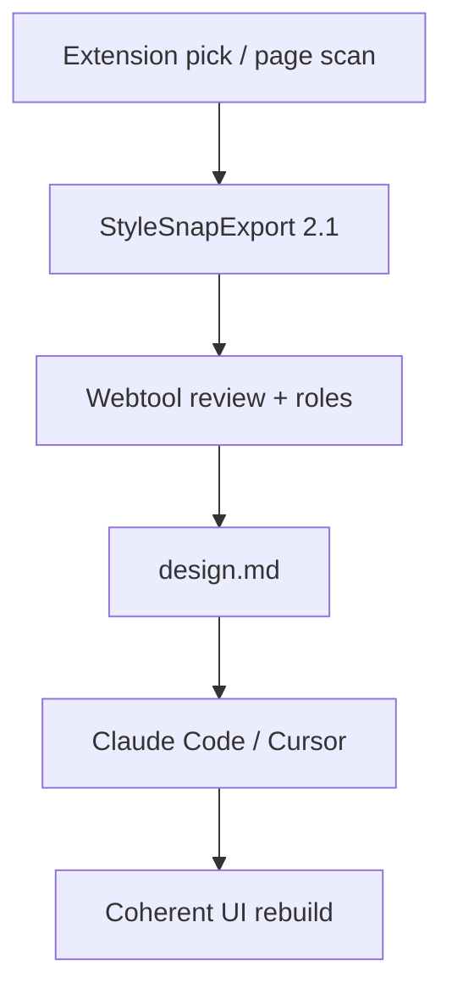

# Extension capture → coherent `design.md` reproduction

North star (PRD §11 / FR-24): **exported `design.md` applies consistently in a downstream AI tool with no ambiguity.** Capture v2 exists to fill the sections that today are empty Gaps — so “copy this design” means tokens *and* the rules that hold them together.



---

## What the extension captures today

One click → `getComputedStyle` → flat tokens + weak context. Contract: [`docs/types.ts`](docs/types.ts). Code: [`extension/src/content/extract.ts`](extension/src/content/extract.ts).

| Type | CSS sources | Limits |
|---|---|---|
| **color** | bg, text, border-top | No outline/focus; rgb() only |
| **gradient** | background-image | Multi-layer ignored |
| **typography** | size/weight/lh/tracking/transform | Text nodes only; no decoration/align |
| **spacing** | `paddingTop`, `gap` | No margin / per-side / row-col gap |
| **radius / border-width** | top-left / top only | Asymmetry collapsed |
| **shadow** | box-shadow | No drop-shadow / text-shadow |

Context: `element`, `ariaRole`, `selector`, `cssProperty`, `state` always `"default"`, Tailwind-ish `authoredName` only.

Oracle already shows the reproduction hole — [`docs/examples/design.example.md`](docs/examples/design.example.md) ends with empty **Motion / Voice / Layout** and “Breakpoints, z-index — never capturable.”

---

## What `design.md` needs for coherent copying

An AI agent rebuilding a UI from `design.md` needs more than hex values. Map each **export section** to extractable browser signals:

### 1. Rules for the coding agent (enforceable, not vibes)

Today: generic “use only tokens below.” With capture v2, auto-append **measured constraints**:

| Agent rule (design.md) | Extract from |
|---|---|
| Spacing on 4px (or Npx) grid | Dominant spacing base from padding/gap/margin |
| Type scale ratio ×1.25 (etc.) | Captured sizes across headings/body |
| Don’t invent breakpoints — use these | Page `@media` scan |
| Prefer elevation via shadow, not border | Pattern: cards with shadow vs border-only |
| Focus ring = `color/border/focus` @ Npx | Outline / focus-shadow sample |
| Motion default 150ms ease-out (or captured) | Transition summary |
| Max content width = Npx | Common `max-width` on main/container |

These become bullet lines under **Rules for the coding agent**, same voice as root [`DESIGN.md`](DESIGN.md) §0.

### 2. Color / type / foundations (already strong — deepen fidelity)

| design.md block | Capture enrichment that helps reproduction |
|---|---|
| Color roles + states | Real `:hover` / `:focus-visible` / `:disabled` samples → fewer derived-only states |
| Focus / border | Outline + focus ring as first-class |
| Type roles | letterSpacing / textTransform already; add decoration; capture `h1`–`h6` even with short text |
| Spacing scale | Per-side padding, margin, row/column gap → more scale steps, better sketch anatomy |
| Radius / border / shadow | Four corners; border-style; text-shadow / backdrop-filter when present |
| Gradient | Keep; note “hero-only” if only one capture uses it |

### 3. Components (sketches) — the coherence glue

Oracle §Components is what stops an agent from inventing card padding. Enrich via:

- Same-`captureId` completeness: bg + radius + shadow + padding + gap + type on **one** pick
- State variants on the same selector (`default` / `hover` / `focus`)
- Layout recipe on the group: `display:flex`, `gap`, `align-items`, `max-width`
- Optional pattern pick (element + parent) for “Button inside Card” nesting

Export shape stays sketch lines, e.g.:

```md
- **Card** (`.card`): bg `color/surface/card` · radius `radius/md` · shadow `shadow/sm`
  · padding `space/md` · layout flex column · gap `space/sm` · max-width 720px
```

### 4. Accessibility (already computed) — keep + extend

- Pair text/surface from assigned roles (today)
- Add: focus visible contrast (ring vs surface) when focus tokens captured
- Flag AA failures in Gaps (already intended)

### 5. Mood & voice / Layout / Motion — stop leaving them empty when capture can fill

| System-notes field | Prefill from capture (user can edit) |
|---|---|
| **Layout** | Container `max-width`s, flex/grid recipes, gutter/gap language, breakpoint list |
| **Motion** | Unique `transition` durations + easings; keyframe names if present |
| **Component principles** | Heuristics: “white cards on gray page”, “gradient only on hero”, “elevation via shadow” from capture patterns |
| **Mood / Voice** | **Do not scrape** marketing copy — stay human/templates (PRD). Capture cannot invent brand voice |

### 6. Gaps — only true unknowns

After v2, Gaps should list **undecided roles**, not “breakpoints never capturable” when a page scan found `[640, 768, 1024, 1280]`.

---

## Capture axes ranked by design.md impact

Ordered by how much they improve **coherent AI reproduction**:

1. **Interaction states + focus ring** → Color roles / Components / Agent rules (states stop being invented)
2. **Spacing fidelity (sides, margin, gaps)** → Foundations + Component sketches (layout stops being guessed)
3. **Page foundations scan (breakpoints, motion, z-index)** → Layout / Motion sections + Agent rules
4. **Layout recipes on captures** → Components + Layout notes
5. **CSS variables / readable classes → authoredName** → cleaner role assignment → fewer wrong semantic mappings in export
6. **Pattern / multi-node pick** → denser Components (bridge to V3)
7. **Effects** (backdrop-filter, text-shadow) → Foundations / Effects fidelity

---

## Contract + export shape (concrete)

**Schema 2.1** (additive; team owns [`docs/types.ts`](docs/types.ts)):

- Keep flat `tokens[]` for primitives (multi-emit with precise `cssProperty` / `state`)
- Add optional `meta.foundations`:

```ts
foundations?: {
  breakpointsPx?: number[];      // sorted unique
  motion?: { durationMs: number; easing: string; property?: string }[];
  zIndex?: number[];             // sorted unique from picks or scan
  contentMaxWidthsPx?: number[]; // common container max-widths
  spacingBasePx?: number;        // detected grid (e.g. 4 or 8)
}
```

- Optional per-capture layout hint (not a mergeable primitive), e.g. on export grouping or `context`:

```ts
layout?: {
  display: string;
  flexDirection?: string;
  justifyContent?: string;
  alignItems?: string;
  gridTemplateColumns?: string; // or trackCount
  maxWidthPx?: number;
  gapPx?: number;
}
```

Webtool export ([`src/engine/export/index.ts`](src/engine/export/index.ts), [`sketches.ts`](src/engine/export/sketches.ts), [`notes.ts`](src/engine/export/notes.ts)):

- Prefill System notes Layout/Motion from `meta.foundations` + layout hints (editable)
- Emit **Breakpoints / z-index** under Foundations when present
- Extend Agent Rules bullets from measured constraints
- Richer Components lines from layout + states

---

## Phased delivery

### Phase 0 — Team contract 2.1
Additive types + zod twin; 2.0 fixtures still parse.

### Phase 1 — Capture fidelity that lands in design.md immediately
Extension: per-side spacing/margin/gaps; radii; `var(--*)` authoredName; hover/focus/disabled; outline; modern colors.  
Webtool: consume states; richer Component sketches; Agent rules for focus ring + spacing grid when detectable.

### Phase 2 — Page scan → foundations in design.md
Opt-in “Scan page”: breakpoints, motion, z-index, content max-widths → `meta.foundations` → Foundations + Layout/Motion notes; remove permanent “never capturable” Gaps when data exists.

### Phase 3 — Layout recipes + pattern pick
Per-capture layout blob; optional multi-node pattern → Layout notes + nested component sketches. Component *roles* stay V3.

---

## Out of scope (would hurt coherence or product rules)

- Scraping page marketing text as “voice”
- Whole-site style dump (noise > signal for agents)
- Auto-finalizing roles without human review
- Full component reconstruction (PRD V3)

---

## Success criteria (design.md-centric)

- Pasting export into Cursor/Claude Code: agent uses listed breakpoints, motion defaults, and component padding/gap — not invented ones.
- Oracle-style Gaps no longer claim breakpoints/motion/layout when a browser capture+scan provided them.
- Hover/focus appear as captured provenance in Color/Components, not only “derived”.
- 2.0 fixtures + existing export tests stay green; new fixture `capture-browser-v2.json` drives an extended oracle section.

---

## Key files (later implementation)

- [`extension/src/content/extract.ts`](extension/src/content/extract.ts)
- [`extension/src/sidepanel/`](extension/src/sidepanel/) — scan UX
- [`docs/types.ts`](docs/types.ts) / [`docs/schema.ts`](docs/schema.ts)
- [`src/engine/export/`](src/engine/export/) — design.md sections
- [`src/engine/completeness/index.ts`](src/engine/completeness/index.ts)
- [`docs/examples/design.example.md`](docs/examples/design.example.md) — oracle update
- [`docs/DECISIONS.md`](docs/DECISIONS.md)
