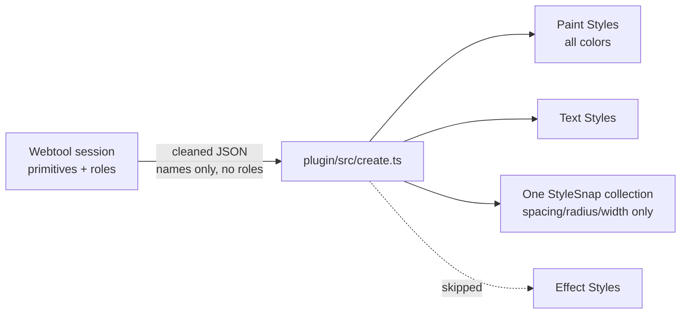
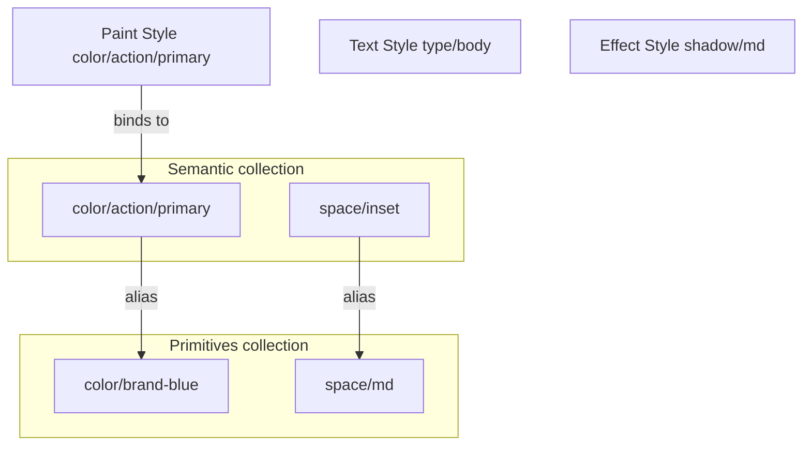

# Figma design-system handoff (web → plugin)

## Problem today



- [generateCleanedJson](src/engine/export/index.ts) fills `token.name` but **does not export** `assignments` (roles).
- [plugin/src/create.ts](plugin/src/create.ts) treats every named color as a **Paint Style**, numbers as **Variables**, shadows as skipped — no primitive/semantic split, no aliases.
- Weird names come from web **fallbacks** (`color/2e6bff`, `space/16`) plus plugin `sanitizeVariableName` (`.` → `-`).

That fights DECISIONS §2.3 / PRD FR-26: semantic-first + Variable aliasing.

## Target Figma model (reconciles UX + Figma capabilities)

Figma: Variables alias; Styles do not. Styles still win for **composites** (type, effects, gradients) and as the brush designers click.

| StyleSnap layer | Figma target | Why |
|---|---|---|
| Color / spacing / radius / border-width **primitives** | Variables in collection **`StyleSnap / Primitives`** | Raw palette + scales |
| Color / spacing / radius / border-width **roles** | Variables in **`StyleSnap / Semantic`** that **alias** the primitive Variable | Theming + FR-26; numbers have no Style |
| Color **roles** (extra) | Paint Styles named like the role, **bound** to the semantic COLOR variable | Styles panel UX (“sometimes styles”) |
| Type **roles** (+ unused type primitives) | Text Styles | Composite typography |
| Gradients | Paint Styles only | Not a solid COLOR variable |
| Elevation / inset / blur roles | Effect Styles | Shadows skipped today; Variables can’t hold full shadow stacks cleanly |



**Naming:** slash-nested paths unchanged (`color/action/primary`). Prefer user/primitive names from the web; never invent a second scheme in the plugin. Plugin only sanitizes illegal chars.

## JSON design (additive — do not rewrite `docs/types.ts`)

Keep capture envelope intact. Extend **cleaned Figma export** (same pattern as `gaps` / `notes` — ignored by envelope parse):

```ts
// Conceptual shape on CleanedExport
{
  meta, tokens, gaps, notes?, derivation?, accents?,
  roles: Record<string, string>,           // role → tokenId  (NEW)
  figmaHandoff: {                          // NEW — plugin contract v1
    version: "1.0",
    collections: {
      primitives: Array<{ name, type: "COLOR"|"FLOAT", value, tokenId }>,
      semantic: Array<{ name, type: "COLOR"|"FLOAT", aliasOf: string /* primitive name */, role, tokenId }>,
    },
    styles: {
      paint: Array<{ name, kind: "solid"|"gradient", /* solid: bindVariableName OR hex */, tokenId, role? }>,
      text: Array<{ name, typography fields, tokenId, role? }>,
      effect: Array<{ name, layers or blur encoding, tokenId, role? }>,
    }
  }
}
```

**Build rules (web):**
1. Emit `roles` from `ExportInput.assignments`.
2. Build `figmaHandoff` from tokens + assignments + names (`nameOf`):
   - Every color/spacing/radius/border-width token → primitive variable entry (use resolved name).
   - Every assigned role of those types → semantic variable entry with `aliasOf` = primitive’s name; if one token has many roles, emit one semantic var per role (all alias same primitive).
   - Color roles → also paint style rows that reference the semantic variable name.
   - Type roles → text styles; unassigned type primitives → text styles under primitive name.
   - Gradient tokens → paint styles (no variable).
   - Shadow/blur roles (and unassigned shadow primitives if named) → effect styles.
3. Share with Figma continues to download this JSON; UI copy updated to mention Variables + Styles two-tier.

Schema: optional zod for `figmaHandoff` in web + plugin (loose validate; don’t break old JSON — if `figmaHandoff` missing, plugin keeps legacy path or shows “re-export from latest StyleSnap”).

## Plugin changes ([plugin/src/create.ts](plugin/src/create.ts), [plugin/src/code.ts](plugin/src/code.ts))

1. Prefer `data.figmaHandoff` when present.
2. Create/find collections `StyleSnap / Primitives` and `StyleSnap / Semantic` (replace single `StyleSnap` for new imports; leave old collection untouched).
3. Pass 1: create primitive COLOR/FLOAT variables.
4. Pass 2: create semantic variables via `figma.variables.createVariableAlias` → primitive.
5. Paint Styles: for solid semantic colors, create style and bind fill to semantic COLOR variable (Plugin API variable binding on paints). Gradients: paints as today.
6. Text Styles: from `styles.text` (roles first).
7. Effect Styles: from `styles.effect` (map StyleSnap shadow layers → Figma effects; backdrop-blur encoding → `BACKGROUND_BLUR` if API allows, else document skip).
8. Preview UI: show kind `variable-primitive` | `variable-semantic` | `paint-style` | `text-style` | `effect-style`.
9. Idempotent: skip existing names (current behavior).

## Web app changes

- [src/engine/export/index.ts](src/engine/export/index.ts): `roles` + `buildFigmaHandoff(input)` inside `generateCleanedJson`.
- New pure module e.g. `src/engine/export/figma-handoff.ts` + unit tests from oracle fixtures.
- [ShareExportModal](src/components/shell/ShareExportModal.tsx) / export copy: clarify two-tier handoff.
- Docs: append DECISIONS §2.x + PRD FR-26 note; short `docs/FIGMA_HANDOFF.md` for Theresa/plugin.

## Out of scope (this pass)

- Changing capture `types.ts` token shape.
- Dark-mode modes / multi-mode collections.
- W3C DTCG full replace (can map later from `figmaHandoff`).
- Overwriting existing Figma assets.

## Acceptance

- Export JSON contains `roles` and `figmaHandoff` for a reviewed session.
- Plugin import creates aliased semantic color + spacing variables and Paint Styles for color roles.
- Re-import without overwrite; shadows become Effect Styles when roles/names exist.
- Legacy JSON without `figmaHandoff` still imports (legacy mapping) with a soft warning.
