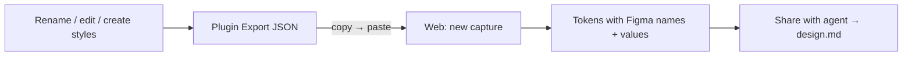

# Figma → web reverse sync (plugin-only MVP)

## What you want (confirmed)

In Figma you **rename a style**, **change a color**, or **create new styles** → Export → paste into the web app → those **names and values show up** as tokens. Then you can export `design.md` again.

**Yes — that is exactly what this plan does.** No web-app changes needed.

**New styles:** Yes — they come through. Export reads **all local** Paint / Text / Effect Styles in the file (not only ones StyleSnap created). A style you add in Figma becomes a token on paste.

**Semantic roles win:** When the same color exists as a Primitive (`color/9f6bff`) and a Semantic Variable / Paint Style (`color/feedback/warning`), the export keeps the **role name** so the web can harvest system roles instead of inventing “derived” fills.

**New Variables:** Yes if they live in **`StyleSnap / Primitives`** or **`StyleSnap / Semantic`** (or you add them there). Variables in other collections are out of scope for v1 unless we widen later.

---

## Build scope

### Plugin — “Export to StyleSnap” button

[`plugin/src/ui.html`](plugin/src/ui.html), [`plugin/src/code.ts`](plugin/src/code.ts), new [`plugin/src/export-system.ts`](plugin/src/export-system.ts):

- Read **`StyleSnap / Primitives`** + **`StyleSnap / Semantic`** (default mode; resolve aliases to concrete COLOR/FLOAT values).
- Read **all local** Paint / Text / Effect Styles (`getLocalPaintStylesAsync` / Text / Effect) — includes newly created styles.
- Emit valid **`StyleSnapExport`**:
  - Each variable/style → a token with **current Figma name** (`name` + `authoredName`) and **current value** (hex, px, typography, shadow layers)
  - Dedup by value+type when the same color exists as both a Variable and a Paint Style (prefer keeping both named entries if names differ; otherwise one token with best name)
  - `meta.source: "figma"`
- Copy JSON; warn if StyleSnap collections missing (styles-only export still OK).
- Avoid SES `import (` string trap in copy.

### Web

**Unchanged.** Paste into ImportZone like any capture — renamed styles and edited colors appear as tokens.

### Docs

Short note in [`docs/FIGMA_HANDOFF.md`](docs/FIGMA_HANDOFF.md) + DECISIONS §2.x.

---

## Out of scope

- Pushing JSON over the network into the web app (copy/paste only)
- Dark-mode / multi-mode
- Exporting unrelated non-StyleSnap libraries

---

## Effort

Small–medium, **plugin-only**.
