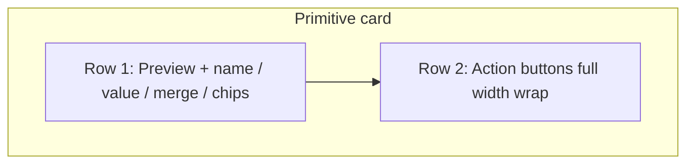

# Fix Primitive inventory card layout

## Problem
In [`PrimitiveInventory.tsx`](src/components/PrimitiveInventory.tsx), each card puts **preview + name/meta/chips + action buttons** in one horizontal `flex` row (`items-start gap-3`). On Colors (`md:grid-cols-2`), cards are ~half width; **Change merged… / Un-merge / Exclude** sit beside the name and collide with the InlineName (screenshot: buttons cover “unnamed”). Role chips pile under the squeezed left column while the right half stays empty.

## Approach (stacked band, responsive wrap)
Restructure each primitive `<li>` into **two bands** (same pattern for system-created rows where relevant):

1. **Identity row** — `flex gap-3 min-w-0`
   - Preview (`shrink-0`)
   - Content column (`min-w-0 flex-1`): InlineName, value caption, merge hint, `RoleChips`
2. **Actions row** — `flex flex-wrap items-center gap-2` (full card width)
   - Change merged… / Un-merge (or locked caption) / Exclude|Delete
   - On very narrow widths buttons wrap to a second line instead of overlapping text
3. **Alignment** — `items-center` on the actions row so ghost Exclude aligns with secondary buttons; keep `size="sm"` and DESIGN.md tokens only.

No logic changes — only markup/classes. `mergesLocked` behavior stays as today.

## Files
- Primary: [`src/components/PrimitiveInventory.tsx`](src/components/PrimitiveInventory.tsx) (primitive list items ~217–288; mirror stacking for system-created list if it still uses a single crowded row)
- Docs: short DECISIONS §6 history row + tiny §2.x note only if we treat layout as a lasting UX constraint (likely a one-line history entry under polish; skip new §2.x if purely CSS)

## Checks
- Spot-check Colors 2-col + mobile (~375px): name fully readable; buttons wrap under content
- `npm test` + `tsc --noEmit` (no behavior change expected)
