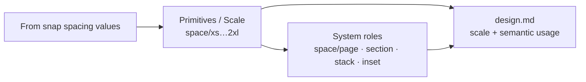

# Semantic spacing (lean) — move scale to primitives

## Verdict

**Yes, this makes sense.** Today `space/xs…2xl` are **scale steps dressed as System roles**. Colors already do two-tier (primitive → job); spacing skips the job layer. That’s why `design.md` can list a full scale and an agent still builds a page with **no margin**.

| Approach | Take |
|---|---|
| Only add “margin = 2× `space/xl`” in Layout notes | Too weak — agents follow **tokens/roles**, not soft prose |
| Long semantic list (after-title, after-paragraph, button-padding, …) | Reject for V1 — overlaps, hard to fill, fights “lean Appendix B” |
| **Lean semantics + keep the scale** | **Ship this** — matches color model and fixes the real gap |

**Do not rename the scale away from `space/xs…2xl`.** Those names stay as the **primitive scale** (Figma-friendly, already in the oracle). What changes is **where they live in the UI** and **what System roles mean**.

## Target model

**Canonical semantic set (4 only):**

| Role | Job | Default seed from scale |
|---|---|---|
| `space/page` | Page / container horizontal inset (fixes edge-stick) | → `space/xl` (or `2xl` if xl empty) |
| `space/section` | Between major sections | → `space/2xl` |
| `space/stack` | Vertical rhythm between related blocks (title→body, paras) | → `space/lg` |
| `space/inset` | Padding inside cards / buttons / inputs | → `space/sm` |

Completeness (B.5): keep **≥ 4 scale steps**, and add **`space/page` required** (the failure mode you hit). The other three semantic roles are suggested, not required.

**Explicitly out of V1:** space-after-title, space-after-paragraph, button-padding, gutter, max/min margin as separate roles. Component sketches can keep citing scale steps (`inner gap space/xs`) until they can prefer `space/inset` / `space/stack` when assigned.

## Product / doc changes (same task)

1. **[PRD Appendix B](docs/PRD_webtool_v2.md)** — B.3 becomes:
   - **Scale (primitives):** `space/xs…2xl` (completeness ≥ 4)
   - **Semantic spacing roles:** the 4 above (`space/page` ✅)
   - B.4 hint table: margin/padding on `body`/`main`/`[data-layout=page]` → `space/page`; large vertical gaps → `space/section`; etc.
2. **[DECISIONS.md](docs/DECISIONS.md)** — new §2.x: two-tier spacing; reject long list + prose-only fix.
3. **[design.example.md](docs/examples/design.example.md)** — Foundations keep the scale line; add a **Spacing roles** line/table; Agent rules / Layout: “Always apply `space/page` to page/container inset; never flush content to the viewport edge.”
4. **Custom roles** (`space/section` already possible today under §2.30) — once Appendix B owns these names, customs cannot collide (existing `buildCustomRole` rule).

## Engine / UI implementation

### 1. Taxonomy & completeness
- [`src/engine/roles/taxonomy.ts`](src/engine/roles/taxonomy.ts) — keep `SPACE_SLOTS` as scale definitions; add `SPACE_SEMANTIC_ROLES` (4); include both in `ALL_ROLES` (scale first, then semantics — or semantics first for System roles UX; scale still used for completeness).
- [`src/engine/completeness/index.ts`](src/engine/completeness/index.ts) — gap for missing `space/page`; keep ≥4 scale check.
- [`src/engine/roles/derive.ts`](src/engine/roles/derive.ts) — keep ascending-size → scale slots; **do not** auto-assign blurry context into semantics except strong signals (e.g. `margin`/`padding` on `body`/`main` → `space/page` candidate).

### 2. Seed semantics from scale (derivation)
- New helper (e.g. in `derive-system/` or `roles/`): if semantic role empty and target scale step is filled, seed fill pointing at the same primitive (method: `from scale`).
- User can reassign; reversible like other derived fills.

### 3. Spacing category UX ([`TokenCategory.tsx`](src/routes/TokenCategory.tsx) + [`EditRolesPanel.tsx`](src/components/EditRolesPanel.tsx) + primitives)
- **Primitives:** treat scale steps as the spacing primitive inventory (labels `space/xs…`, not “roles”). Optionally a short “Scale” caption: these are steps, not layout jobs.
- **System roles:** show only the 4 semantic roles (+ any `space/*` customs that aren’t scale steps).
- Gap panel / Add token presets: prefer “Add / assign `space/page`” when missing.

### 4. Export ([`src/engine/export/index.ts`](src/engine/export/index.ts))
- Foundations: keep **Spacing scale** line.
- Add **Spacing roles** (page / section / stack / inset → values + provenance).
- Strengthen Layout / Agent rules when `space/page` is set (and a Gap line when it isn’t).
- Component sketches: prefer semantic roles when present (`padding space/inset`), else fall back to scale (current behavior).

### 5. Tests & oracle
- Update fixtures/oracle expectations in [`src/engine/export/export.test.ts`](src/engine/export/export.test.ts), completeness tests, roles tests, [`docs/examples/design.example.md`](docs/examples/design.example.md).
- Draft migration: old sessions with only scale assignments still valid; semantics seed on next derive.

## What we are not doing
- Replacing the scale with semantics (agents still need `xs…2xl`).
- Radius/shadow same refactor in this pass (same smell later; out of scope).
- Changing `types.ts`.

## Suggested ship order
1. Docs + taxonomy + completeness + seed mapping + tests (engine green first).
2. Spacing page UI split (Primitives = scale, System roles = semantics).
3. design.md Foundations + Agent/Layout copy + oracle.
4. DECISIONS §2.x + §6 row.